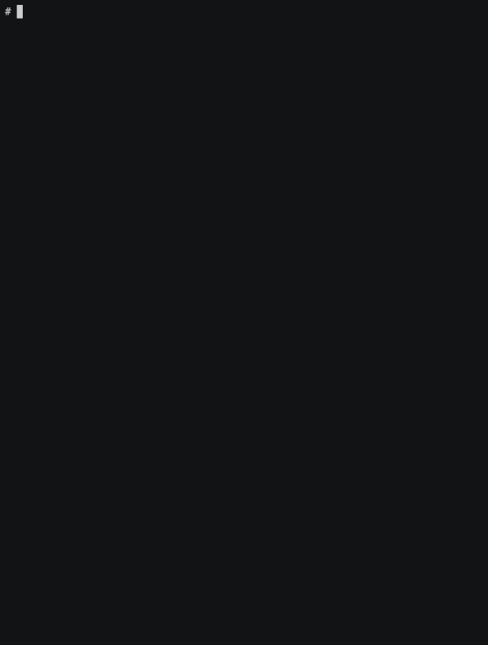

# Unbounded Adapt

Adapt is a system to easily, reliably, and repeatably deploy applications.  Adapt specifications look like [ReactJS](https://reactjs.org) apps, but instead of rendering browser DOM elements like input, or div, Adapt specifications render to DOM elements like AWS EC2 instances, Lambdas, Kubernetes Pods, or any other building block for your application architecture.  If you are already familiar with React, many of the concepts will look familiar. If not, don't worry, knowledge of React isn't required to start using Adapt.

## Getting Started
For a new project, you can get started without knowing much about Adapt by using a starter.  The [Getting Started Guide](https://adapt.unbounded.systems/docs/getting_started) will walk through installing Adapt and deploying a starter project.
```shell
adapt new <starter> <project directory> #Create a new project from a starter
adapt run --deployID <myID> #Create a new deployment of the starter project
... #write some code
adapt update <myID> #Update the running deployment
```

Deploy a sample application with a [React](https://reactjs.org) front-end, a [Node.js](https://nodejs.org) API server, and a [Postgres](https://postgresql.org) database, along with a static file server and a URL router:



A snippet of the corresponding Adapt specification that the starter sets up for this example:
```jsx
import { HttpServer, UrlRouter } from "@adpt/cloud/http";
import { NodeService } from "@adpt/cloud/nodejs";
import { Postgres } from "@adpt/cloud/postgres";
import Adapt, { Group, handle } from "@adpt/core";
import { k8sStyle, laptopStyle, prodStyle } from "./styles";

function App() {
    const pg = handle();
    const api = handle();
    const stat = handle();

    return <Group key="App">

        <UrlRouter
            port={8080}
            routes={[
                { path: "/api/", endpoint: api },
                { path: "/", endpoint: stat }
            ]} />

        <NodeService handle={api} srcDir=".." connectTo={pg} />

        <Postgres handle={pg} />

        <HttpServer handle={stat} scope="cluster-internal"
            add={[{ type: "image", image: api, stage: "app",
                    files: [{ src: "/app/build", dest: "/www/static" }]}]} />

    </Group>;
}

Adapt.stack("default", <App />, k8sStyle);
```

## Further Reading
* [Getting Started Guide](https://adapt.unbounded.systems/docs/getting_started)

    This guide will walk you through setting up Adapt and then deploying an example MovieDB app.

* [Adapt Documentation](https://adapt.unbounded.systems)

    Adapt tutorials, API References, and more.

## Getting Help
[](https://gitter.im/UnboundedSystems/Adapt)

We'd love to hear about your experience with Adapt!
Join us on our [Gitter channel](https://gitter.im/UnboundedSystems/Adapt) to ask questions or to give us your feedback and suggestions.

If you've found a bug, you can also [file an issue](https://gitlab.com/unboundedsystems/adapt/issues).
