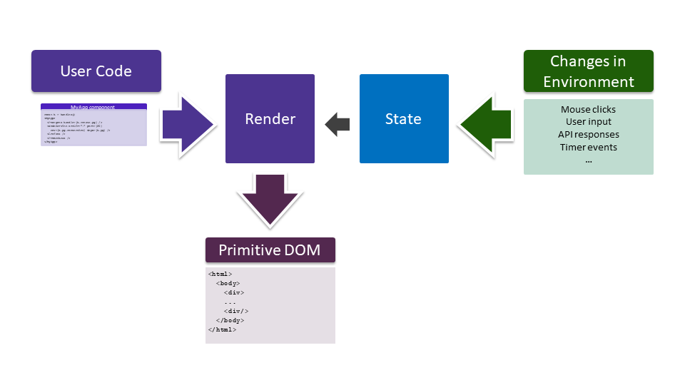

# Concepts: Comparing Adapt and React

> **Tip**
>
> This guide is an in-depth comparison meant for developers who are already familiar with [ReactJS](https://reactjs.org). If you're not already familiar with React, we suggest reading [Adapt Concepts](../user/concepts/index.md) from our user manual instead.
>
> Or, if you'd prefer to learn by doing, start with our [Getting Started Guide](../gsg/index.md).

<!-- START doctoc generated TOC please keep comment here to allow auto update -->
<!-- DON'T EDIT THIS SECTION, INSTEAD RE-RUN doctoc TO UPDATE -->
## Table of Contents

- [Introduction: A Movie Database App](#introduction-a-movie-database-app)
- [Adapt Elements & JSX/TSX](#adapt-elements-&-jsxtsx)
- [Components & Props](#components-&-props)
- [Handles](#handles)
    - [Attaching Handles to Elements](#attaching-handles-to-elements)
    - [Calling Imperative Method Hooks](#calling-imperative-method-hooks)
- [Hooks](#hooks)
- [Style Sheets](#style-sheets)
    - [Separating Content from Style](#separating-content-from-style)
- [Element State](#element-state)
- [The Virtual DOM](#the-virtual-dom)
    - [React: Rendering](#react-rendering)
    - [Adapt: Building](#adapt-building)
    - [Observing the Environment](#observing-the-environment)
- [Footnotes](#footnotes)

<!-- END doctoc generated TOC please keep comment here to allow auto update -->

## Introduction: A Movie Database App
Adapt is the easiest way to reliably and repeatedly deploy your apps anywhere -- to your laptop, a Kubernetes cluster, your favorite cloud, or anywhere else.

Many of the concepts used in Adapt are similar to concepts used in ReactJS.
React is a framework that makes it easy to describe complex user interfaces and how those user interfaces interact with and change in response to the external world.

Similarly, Adapt makes it easy to describe complex apps, how the various components of an app get deployed, and how those components interact with and change in response to each other and the external world.

This guide will cover some key concepts in Adapt, along with their React counterparts, where applicable.
But to illustrate most of these concepts, we'll need a sample app that has a little bit of complexity.

Since you're a developer familiar with React, the sample app that we'll use is a small movie database app that consists of:
- A front end user interface written in React.
- A REST API microservice written in Node.js.
- A database for the REST API microservice.
- A web server to serve static content like HTML, CSS, and images.
- A URL router to steer HTTP requests to either the REST API microservice or the static web server.


Below is the Adapt description of the movie database app.
The rest of this tutorial will explain all the parts that make up this app description.

```tsx
function MovieApp(props: { publicPort: number }) {
  const api = handle();
  const pg = handle();
  const stat = handle();

  const connectEnv = useMethod(pg, {}, "connectEnv");

  return (
    <Group>

      <UrlRouter
        port={props.publicPort}
        routes={[
          { path: "/api/", endpoint: api },
          { path: "/", endpoint: stat }
        ]} />

      <NodeService handle={api} srcDir=".." env={connectEnv} />

      <Postgres handle={pg} />

      <HttpServer handle={stat} scope="cluster-internal"
        add={[{
          type: "image", image: api, stage: "app",
          files: [{ src: "/app/build", dest: "/www/static" }]
        }]} />

    </Group>
  );
}
MovieApp.defaultProps = { publicPort: 8080 };

Adapt.stack("laptop", <MovieApp />, laptopStyle);
Adapt.stack("prod", <MovieApp />, prodStyle);
Adapt.stack("k8s", <MovieApp />, k8sStyle);
```

If you know React, this probably looks mostly familiar, but with a few new things too.
Let's jump in and take a look at all the pieces that make up this description.

> **Tip**
>
> To get all the code for this movie database and deploy the fully functioning app to an existing Docker instance on your local system:
>
>     npx @adpt/cli new moviedb-react-node
>     cd moviedb-react-node
>     npx @adpt/cli deploy laptop

## Adapt Elements & JSX/TSX
Adapt specifications are written in TSX or JSX[^1] and produce a virtual DOM that is made up of Elements, just like React.

[^1]: JSX supported in a future release. See unboundedsystems/adapt#108.

The following code creates a NodeService Adapt Element:
```tsx
<NodeService srcDir=".." />
```

Adapt currently uses the JSX/TSX processor from the TypeScript compiler with no modifications or extensions.
For a more in-depth description of JSX/TSX, see [Introducing JSX](https://reactjs.org/docs/introducing-jsx.html) from the React docs.

## Components & Props
Just like React, Adapt Components let you split an application into independent, reusable pieces, and allow you to think about those Components in isolation.
In our movie database app, `MovieApp` is a Component that describes our entire app.

```tsx
function MovieApp(props: { publicPort: number }) {
  ...
  return (
    <Group>
      <UrlRouter port={props.publicPort} ... />
      <NodeService ... />
      <Postgres ... />
      <HttpServer ... />
    </Group>
  );
}
```

As with React, every Component can accept arbitrary inputs, called `props`.
Here, `MovieApp` accepts a prop called `publicPort` and it passes the value of `publicPort` to the `UrlRouter` Element's `port` prop.

In both React and Adapt, Components return a set of Elements.
In React, the Elements that a Component returns describe what should be displayed in the browser.
In Adapt, the Elements that a Component returns describe infrastructure resources that should be instantiated.

The `MovieApp` Component returns the set of Elements that describe our movie app:
- A `Group` Element that is simply a container that holds other Elements.
- One Element for each of the 4 main pieces that make up the back end of our app (a URL router, a Node.js service, a PostgreSQL database, and an HTTP web server).

React and Adapt both have two types of Component: Function Components and Class Components.
And as with React, most Components can be written as either a Function Component or a Class Component, with Function Components tending to be slightly more concise.
However, there are some features that are unique to each of the two types of Component, which are described in more detail in the [Adapt User Guide](../user/index.md).
`MovieApp` is a Function Component.

## Handles
React uses the concept of a `ref` to allow a Component to reference and interact with specific Elements or browser DOM nodes.
This is typically used for imperatively modifying an Element, such as to set focus or trigger an animation.

Adapt has a similar concept, called a `Handle` which also allows you to reference and interact with Elements.

Adapt Handles are used for:
- Calling an imperative method on an Element instance, typically to get information like a dynamic hostname or port number that is not known until after a deployment is instantiated.
- Creating an explicit dependency on an Element.

### Attaching Handles to Elements
Our `MovieApp` component contains several uses of Handles.
It starts by creating three new Handles and assigning them to variables `pg`, `api`, and `stat`.
But to make a Handle actually refer to a specific Element, the Handle must be _attached_ by passing the Handle to an Element as its `handle` prop.

Here, the `api` Handle will now refer to the `NodeService` Element, `pg` will refer to the `Postgres` Element and `stat` will refer to `HttpServer`.

```tsx
function MovieApp(props: { publicPort: number }) {
  const api = handle();
  const pg = handle();
  const stat = handle();
  ...
      <NodeService handle={api} ... />
      <Postgres handle={pg} ... />
      <HttpServer handle={stat} ... />
```

### Calling Imperative Method Hooks
Because our app can be deployed into many types of dynamic environments, there are some things we don't know in advance.
For example, in our movie app, we don't know where the Postgres database will be deployed or how a client can connect to it once it is deployed.
To address this, the Postgres Component has an imperative `connectEnv` method that returns a set of environment variables that follow the Postgres conventions for how to connect to a Postgres database.

The reason `connectEnv` is called via the `useMethod` [hook](#hooks) instead of a direct call of the component method is due to `connectEnv` using state to store the hostname or IP address information, once Postgres has been deployed. For more info on how this works, see [Element State](#element-state).

In the movie app, we use the `useMethod` hook to call the `connectEnv` method on the handle named `pg`.
Then, the resulting `connectEnv` variable is passed into the `NodeService` Element.
When `NodeService` is deployed, it will have the resulting dynamically created environment variables that allow it to connect to the Postgres database.

```tsx
  const connectEnv = useMethod(pg, {}, "connectEnv");
  ...
      <NodeService env={connectEnv} ... />
```

The `UrlRouter` Element also uses Handles to specify where to route different HTTP URL paths.
The `routes` prop is given an array that describes each route, where `endpoint` is a Handle that refers to an Element that must provide imperative instance methods `hostname` and `port`.
For each `endpoint`, UrlRouter will call the `hostname` and `port` methods to build its own configuration dynamically when it is deployed.

In the movie app, `UrlRouter` is configured to route URL paths that start with `/api/` to the `NodeService` REST API Element and all other URLs to the static HTTP server.

```tsx
      <UrlRouter
        routes={[
          { path: "/api/", endpoint: api },
          { path: "/", endpoint: stat }
        ]} ... />
      <NodeService handle={api} ... />
      <HttpServer handle={stat} ... />
```

## Hooks
[Hooks](https://reactjs.org/docs/hooks-intro.html) are a concept common to both React and Adapt.
While Components allow you to encapsulate and reuse _structure_, hooks allow you to encapsulate and reuse _behaviors_.

In the movie app, the library function `useMethod` is a hook function that encapsulates the behavior of calling a method on an Element instance referenced by a Handle.

```tsx
  const connectEnv = useMethod(pg, {}, "connectEnv");
```

Just as with React, Hooks can be used to manage state in Functional Components and, by convention, always start with `use`.

## Style Sheets
### Separating Content from Style
Although React doesn't directly specify how to integrate with [Cascading Style Sheets](https://developer.mozilla.org/en-US/docs/Web/CSS), CSS is critically important for any browser-based interface.

One key reason why CSS is so powerful is because it enables separating the _content and structure_ of what is to be displayed (e.g. text, images) from the _style_ of how it is to be displayed (e.g. color, position, size).
In this separated model, content and structure are defined via the DOM and HTML, and style is defined via CSS.

Adapt has a very similar concept called Style Sheets that also enable separating the _content and structure_ of your app from the _style_ of how the app should be deployed.

CSS has another important and powerful concept called [selectors](https://developer.mozilla.org/en-US/docs/Web/CSS/CSS_Selectors) that make it easy to operate on very large browser DOMs that contain thousands of elements.
CSS selectors make it easy to choose a specific set of elements upon which to apply style.
For example, you can select all `<div>` elements to remove their border, make every `<caption>` element have a larger font, or make the background of only the element with a particular ID red.

You can find out more about style sheets in the [Intro to Adapt Concepts Tutorial](../tutorial_concepts/03_style.md).

## Element State
Both React and Adapt use the concept of *state*.
In both systems, every Element instance has its own private state storage, unique to that Element instance.

State is accessed similarly in both systems.
When writing a Class Component, state can be read from the class member variable `state` and modified using the class member function `setState`.
For a Function Component, state is accessed with the `useState` hook.

> **Adapt Difference**
>
> In React, Class Components set an initial state by assigning to `this.state` in the class constructor.
> In Adapt, the initial state cannot be set this way.
> Instead, all Adapt Class Components that use state **must** define an `initialState` class method that returns an object.

## The Virtual DOM

React and Adapt both create and operate on a virtual DOM and use a similar process for processing updates.
This section only provides a high-level comparison of both systems.
For more precise details on how each system works, please check the respective user guides.

### React: Rendering


In React, the Components and other related code that you write, combined with the State, go through a process that React calls *render* that creates the final virtual DOM, made up of primitive Elements.
React can then display that final virtual DOM in the browser.

Events from the browser and from other external sources can cause changes to the React state, which then causes React to run the render process again, potentially changing the final virtual DOM, with resulting changes being shown in the browser.
This process of processing external events and re-rendering the DOM is core to how React operates.

### Adapt: Building


In Adapt, the Components and other related code that you write are called the Adapt *Specification* and *Style Sheets*.
Those two items, combined with the State, go through a process called the DOM *build* that creates the final Primitive DOM.
Adapt can then *deploy* that final Primitive DOM, which is the process that affects actual infrastructure and other resources.

### Observing the Environment
Adapt also has an *observe* process, which runs as part of the overall Adapt build process, for monitoring and responding to external events and data sources.
During the Adapt build process, Components can request to observe the external environment.
After the Primitive DOM is built the first time, those observation requests are satisfied and have the opportunity to change the State.
When the State changes, Adapt will run the build process again, potentially changing the final Primitive DOM.

## Footnotes

