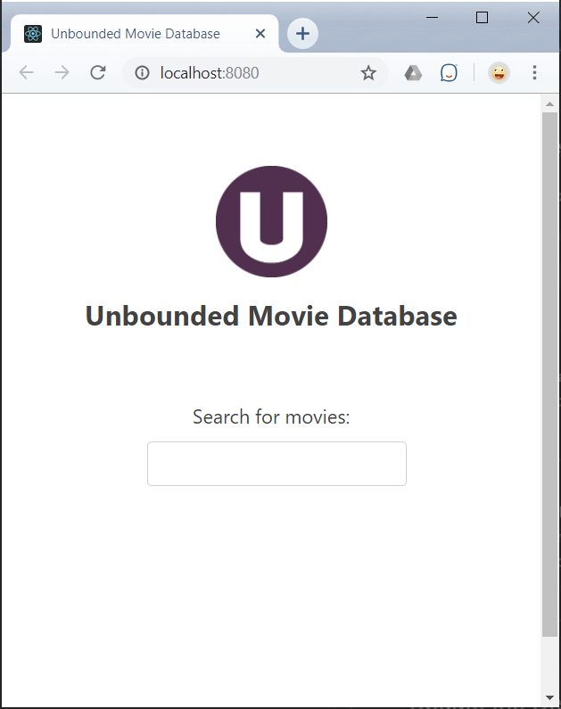

# Step 3: Add Code and Update - MovieDB App

<!-- START doctoc generated TOC please keep comment here to allow auto update -->
<!-- DON'T EDIT THIS SECTION, INSTEAD RE-RUN doctoc TO UPDATE -->
## Table of Contents

- [Writing the Real Application Code](#writing-the-real-application-code)
- [Update!](#update)
- [Test Your New MovieDB App](#test-your-new-moviedb-app)
- [Change and Repeat](#change-and-repeat)
- [Next Step](#next-step)

<!-- END doctoc generated TOC please keep comment here to allow auto update -->

## Writing the Real Application Code

As we've seen, the starter template we used with `adapt new` has created a default set of code for both our front end and back end application.
If we were writing our app from scratch, we'd start writing some React code in the `src` directory and some Node.js code for our API in the `backend` directory.
But for this guide, we'll simply copy in some already-written code for our movie database app:
<!-- doctest command -->
```
curl https://gitlab.com/adpt/gsg-moviedb/-/archive/v1/gsg-moviedb-v1.tar.gz | tar -zxv --strip=1 -C ..
```

This command should have added:
* Some new React UI code in `moviedb/src` and `moviedb/public`.
* Some new Node.js code in `moviedb/backend`.
* A file with some test data `moviedb/deploy/test_db.sql` that will be pre-loaded into the Postgres database when we update the deployment.

## Update!
Now, update the deployment, which will push our newly written code and populate the database with the test data:
<!-- doctest command -->
```
adapt update movieapp
```

## Test Your New MovieDB App

Congratulations!
You have now deployed the complete infrastructure for your new MovieDB app.

Test your newly deployed app by opening the same link in your browser again: [http://localhost:8080](http://localhost:8080)

> **IMPORTANT**
>
> You will most likely need to force your browser to hard refresh the page (reload while bypassing the browser cache).
> Instructions for most browsers can be found [here](https://en.wikipedia.org/wiki/Wikipedia:Bypass_your_cache#Bypassing_cache).

You should now see a page that says **Unbounded Movie Database**, like the one below.
Type into the search box to get a list of matching movies.
Try typing `batman` if your searches turn up empty.



## Change and Repeat

You can now make any changes to the app you'd like and each time you run the `adapt update` command from above, Adapt will re-build any necessary images and automatically re-deploy the changed images to your local Kubernetes cluster.
(Note: Don't forget to make your browser do a hard refresh.)

## Next Step

Next, we'll tear everything down and clean up.

| [<< Step 2: Create and Run - Hello World App](./02_run.md) | [Step 4: Clean Up >>](./04_cleanup.md) |
| --- | --- |
